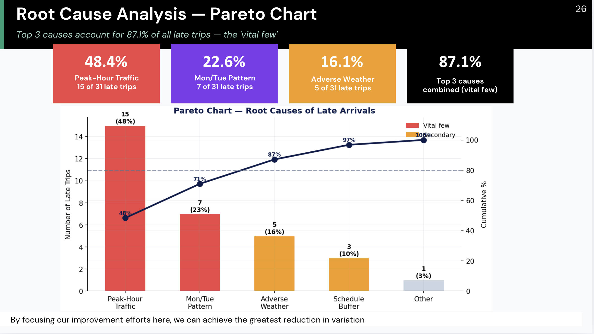

# Greater Bridgeport Transit (GBT) Service Reliability Analysis

A data-driven transit operations and process improvement project focused on evaluating the reliability and statistical stability of Greater Bridgeport Transit (GBT) services along a high-traffic corridor using Statistical Quality Control (SQC), Lean Six Sigma, and DMAIC methodologies.

## Project Overview

This project analyzes transit delay performance and operational variability within the Greater Bridgeport Transit (GBT) system. The objective was to identify sources of service instability, evaluate process capability, and propose operational improvements that could improve schedule reliability and passenger experience.

Using Lean Six Sigma principles and Statistical Quality Control tools, the project applied quantitative analysis techniques to real-world transit operations data to assess process performance and identify root causes of delays.

## Objectives

- Evaluate the reliability and consistency of GBT transit services
- Measure transit delay variability and operational performance
- Apply Statistical Quality Control (SQC) methods to transportation systems
- Identify assignable and common causes of delays
- Recommend data-driven operational improvements
- Demonstrate practical application of Lean Six Sigma and DMAIC frameworks

---

## Methodology

### DMAIC Framework

#### Define
- Identified recurring transit delays and service inconsistency as the primary operational problem
- Defined project goals related to schedule reliability and customer satisfaction

#### Measure
- Collected and analyzed delay data from transit operations
- Measured process variability, lead time, and operational performance indicators

#### Analyze
- Applied root cause analysis techniques
- Identified contributing factors such as:
  - Peak-hour congestion
  - Weather conditions
  - Driver variability
  - Mechanical issues
  - Lack of schedule buffer
  - Traffic signal delays

#### Improve
Proposed operational improvements including:
- Transit Signal Priority (TSP)
- Schedule buffer optimization
- Predictive maintenance strategies
- Dynamic stop-duration adjustments
- Improved dispatch coordination

#### Control
- Recommended ongoing performance monitoring using Statistical Process Control (SPC) charts
- Suggested continuous KPI tracking for service stability

## Tools & Techniques Used

### Statistical Quality Control (SQC)
- Control Charts
- Process Capability Analysis
- Cp/Cpk Analysis
- Variation Analysis
- Root Cause Analysis

### Lean Six Sigma
- DMAIC Methodology
- Waste Identification
- Process Optimization
- Value Stream Mapping (VSM)

### Data Analysis Tools
- Statistical Analysis

## Key Findings

- Transit delays showed significant process variability during peak operating periods
- Negative Cpk values indicated that the process was not operating within acceptable performance limits
- Both common causes and assignable causes contributed to operational instability
- Schedule rigidity and lack of adaptive buffers increased service inconsistency

## Challenges

- Working with real-world transportation data containing variability and inconsistencies
- Distinguishing between controllable and uncontrollable delay factors
- Interpreting statistical process capability metrics within a transit environment
- Balancing operational efficiency with customer service expectations

## Lessons Learned

Through this project, I gained practical experience applying Lean Six Sigma and Statistical Quality Control concepts to transportation operations. I strengthened my skills in:
- Data analysis
- Process improvement
- Operational analytics
- Root cause investigation
- Performance measurement
- Statistical interpretation

This project also enhanced my understanding of how data-driven methodologies can improve service reliability and operational decision-making in public transportation systems.

## Future Improvements

- Integrate real-time GPS and traffic data
- Develop predictive delay models using machine learning
- Implement automated dashboard reporting
- Simulate schedule optimization scenarios
- Expand analysis across additional transit routes

## Author
ELIZABETH KANKAM
Graduate Student | Operations & Logistics Analytics | Process Improvement | Data Analysis

## Keywords

Lean Six Sigma, DMAIC, Statistical Quality Control, Transit Reliability, Process Improvement, Transportation Analytics, Public Transit Operations, Root Cause Analysis, Operational Efficiency

## PRESENTATION FILE CAN BE VIEWED ON CANVA USING THE LINK BELOW: 
https://canva.link/yd4tvix9131lmn5

## ROOT CAUSE ANALYSIS

